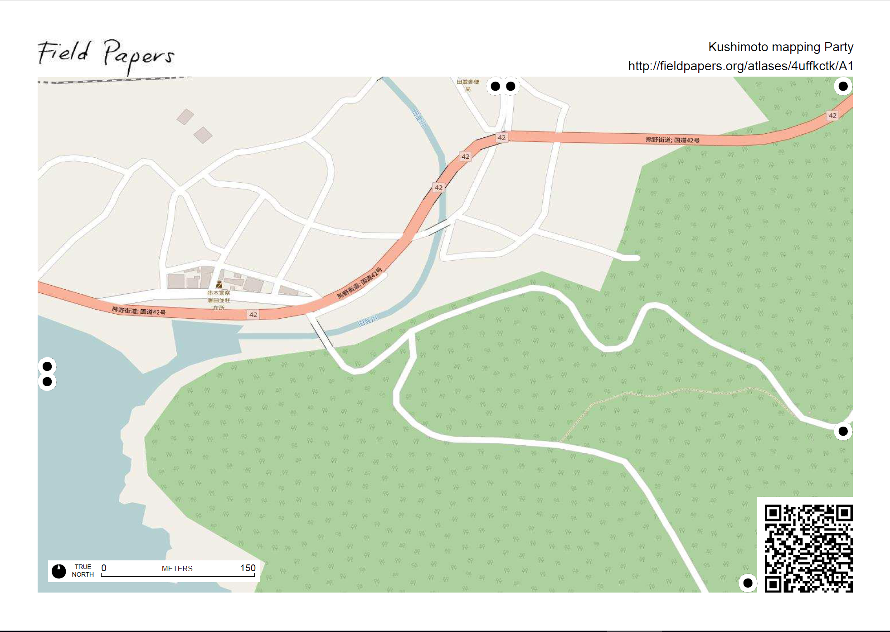
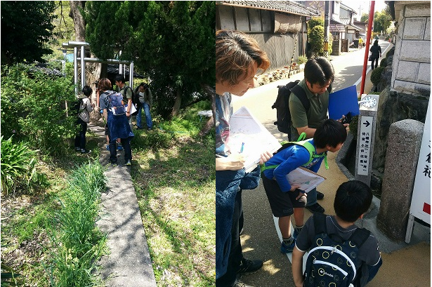
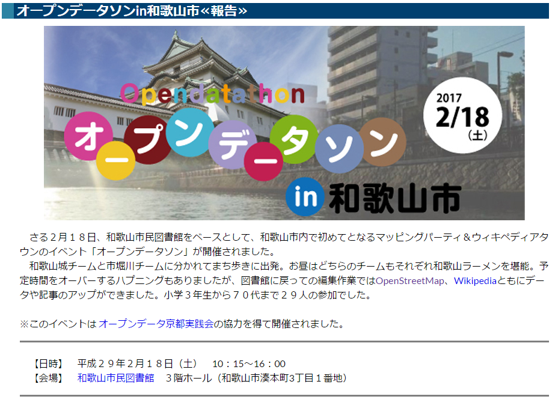
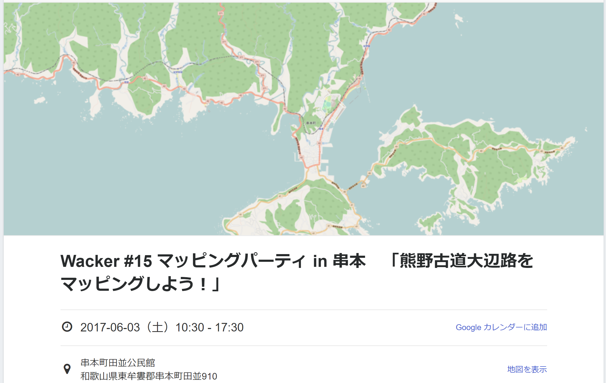
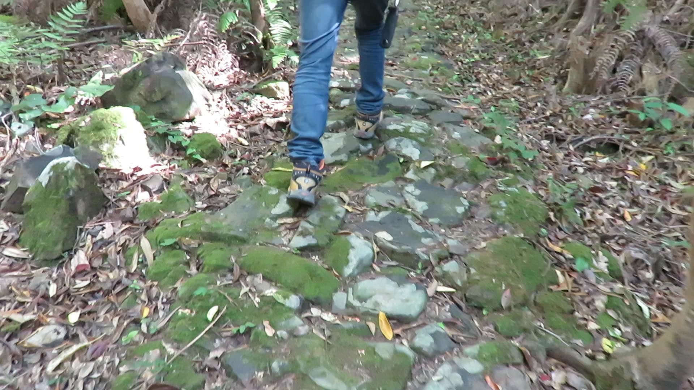
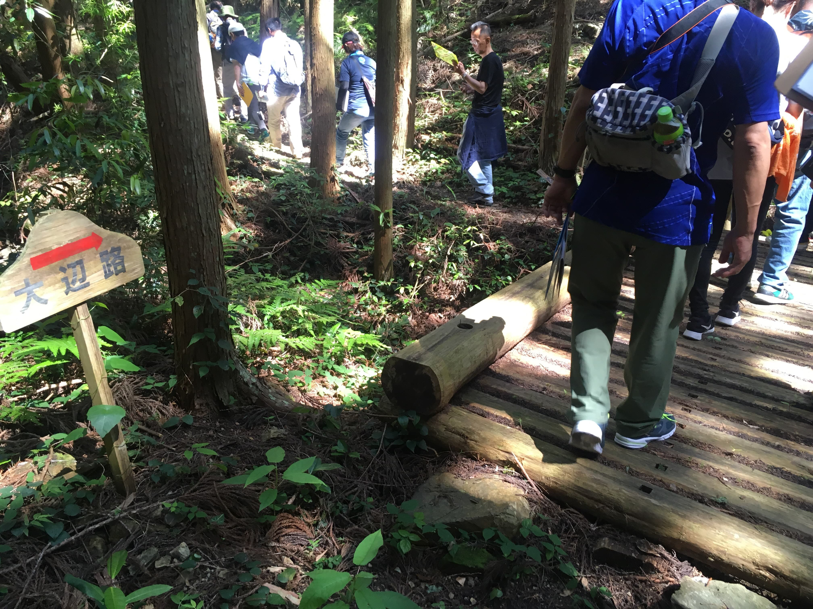

  <small>
  古座街道フェスタ　2017/11/26(日)  
  </small>

 

### 古座街道を3倍楽しむ方法

 

 Yohei Taniguchi 

  <small>

    [Wacker](http://wacker.io/)

  </small>

  

---

### 楽しむ方法って？ 

1. 怪我無く・事故なくイベントを終わらせよう！（家に帰るまでが遠足的な）
1. 普段と視点を変えて道を歩くと普段違う発見がある。
1. 今日のイベントの事を記録に残す

--

### 記録に残す？ 

- インスタ・日記・ブログに残す
  - #古座街道フェスタ2017
- Wikipedia・LocalWikiに残す
- OpenStreetMapに残す ← 今日はコレ

--

### 記録に残すことの意味 

- 思い出に残す
- 地域の情報を記録　← 普段と違う発見が！
- 地域の情報発信

---

### OpenStreetMapで何ができるか？ 

- Wikipedia＝みんなで作る百科事典
- OpenStreetMap＝みんなで作る地図

 

#### そんな訳でマッピングパーティーに参加しよう！！

---

### マッピングパーティーって？

- みんなで現地行って、その見つけた情報をOpenStreetMapに登録

---

#### 現地調査（サーベイ）

- [Field Paper](http://fieldpapers.org/)を印刷して何があったか記録する

  

--

#### 現地調査（サーベイ）

- 最初は、ポスト、案内板、地蔵、石碑など道路脇でポイントになるものを書く

  

---

### 2017年 和歌山で行われた マッピングパーティー

- オープンデータソンin和歌山市
- マッピングパーティ in 串本 「熊野古道大辺路をマッピングしよう！」

--

#### オープンデータソンin和歌山市

http://wida.jp/2017/03/23/odtinwakayama_report/

  

--

#### マッピングパーティ in 串本　 「熊野古道大辺路をマッピングしよう！」

https://wacker.doorkeeper.jp/events/60642

  

---

### マッピングパーティー開催の経緯

- 熊野古道のうち大辺路ルートの一部区間が世界遺産追加登録
- Web地図には大辺路ルートが登録されていない。

---

### 当日の様子

--

#### 午前：オリエンテーション 

--

#### 午前：オリエンテーション 

---

#### 午後（前半）：サーベイ 

--

#### 午後（前半）：サーベイ 

--

#### 午後（前半）：サーベイ 

--

#### 午後（前半）：サーベイ 

--

#### 午後（前半）：サーベイ 

--

#### 午後（前半）：サーベイ 

---

#### 午後（後半）：OpenStreetMap編集 

---

#### 楽しむポイント

- マッピングしながら町を歩くと普段は気づかない景色が見えてくる。
- 地図に書き込んで情報が増えてくることが楽しくなってくる。
- 他にしたいことが出てくる。

---

### OpenSteetMapを編集する上での注意点

- うそや悪戯は書かない。
- 個人情報やプライバシー侵害に繋がる事は書かない。
- 他者の著作権侵害に繋がる事は書かない。
  - 許可無く他の地図から写さない
  - 書籍・雑誌、パンフレットから写さない
  - 誰かのブログやSNSの情報を写さない

#### 自分で確認した情報を登録しましょう！！

---
